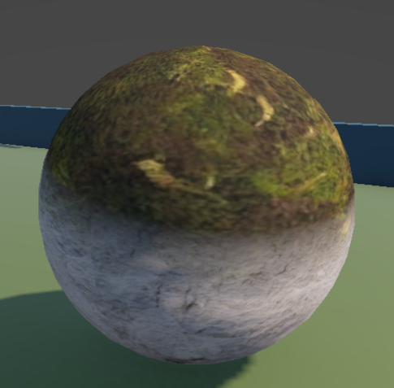

# Moss

Moss material/shader showcase.

## Preview

[Watch Video Demo](./Moss.mp4)

## Shader Breakdown

This graph blends rock and moss textures using directional masking so moss appears mostly on upward-facing areas.

- `_UpNode` controls how strongly upward normals receive moss.
- `_Level` and `_Contrast` sharpen or soften the moss blend boundary.
- `_MossOffset` shifts the moss mask direction/coverage.
- `_Moss_Normals_Strength` and `_Rock_Normals_Strength` balance surface detail.
- `_Rock_Gloss_Strength` and `_Moss_Gloss_Strength` control wet/dry look per layer.
