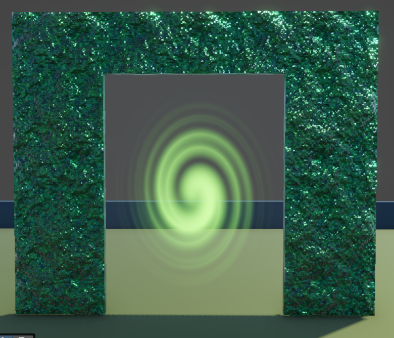

# Portal

Portal material/shader showcase.

## Preview

[Watch Video Demo](./Portal.mp4)

## Shader Breakdown

This portal graph uses UV twirl distortion plus dissolve and masking to create a spinning energy surface.

- `_Twirl_Strength` controls swirl curvature.
- `_Twirl_Speed` controls spin rate.
- `_Scale` changes noise/distortion frequency.
- `_Dissolve_Amount` erodes the portal edge/interior pattern.
- `_Strength` amplifies brightness and effect intensity.
- `_Color` is HDR and sets the portal glow hue.
