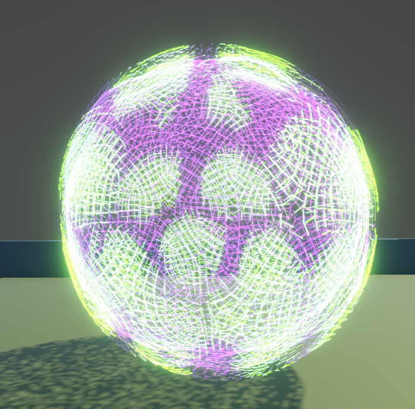

# Shield

Shield material/shader showcase.

## Previews

### Membrane Shader Breakdown

This variant emphasizes a strong fresnel shell with subtle animated vertex offset for a living energy membrane.

- `_Fresnel_Power` and `_Fresnesl_Power` shape edge glow width and falloff.
- `_Fresnel_Color` sets edge-light color.
- `_Main_Color` and `_Shield_Color` define body tint.
- `_Vertex_Offset_Freq` and `_Vertex_Offset_Direction` add gentle surface motion.
- `_Pulse_Speed` and `_Pulse_Distance` drive traveling pulse bands.
- `_Alpha`, `_Base_Strength`, and `_Glow_Strength` control transparency and glow intensity.

### Shield Variant Breakdown

Both shield variants use the same core logic (fresnel edge + pulse + vertex wobble) with different parameter tuning.

- `Shield Mat` is darker with tighter edge highlights.
- `Shield Mat 1` is brighter and more emissive, with a wider fresnel and softer wobble.
