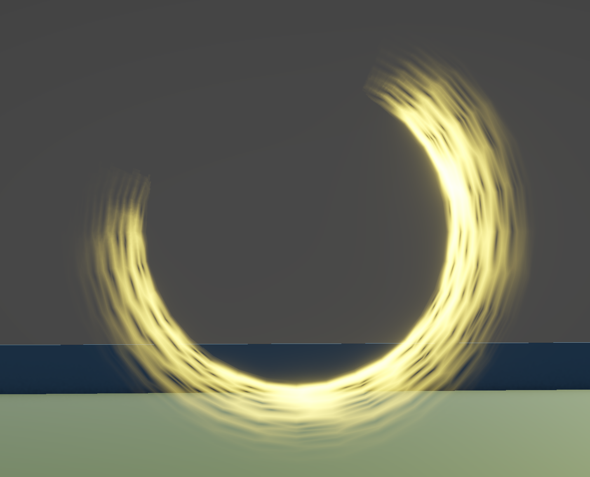

# Slash

Slash material/shader showcase.

## Video

<video src="./Slash.mp4" controls muted loop playsinline width="960"></video>

## Shader Breakdown

This slash effect is driven by animated Voronoi cells that are thresholded and tinted for a sharp energy streak look.

- `_Voronoi_Scale` controls cell density/detail.
- `_Voronoi_Speed` controls animation speed.
- `_Voronoi_Power` sharpens/softens the cell breakup.
- `_Color` is HDR and controls final emissive brightness.

## Image

