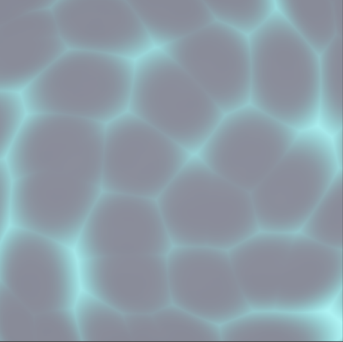

# Water

Water material/shader showcase.

## Preview

## Videos

[Watch Water Demo 1](./Water%201_3.mp4)

[Watch Water Demo 2](./Water%202_3.mp4)

[Watch Water Demo 3](./Water%203_3.mp4)

## Shader Breakdown

This water graph combines scrolling normals, ripple masking, and foam edge shaping for stylized animated water.

- `_Normal_Speed` and `_Normal_Strength` control base wave flow and surface detail.
- `_Ripple_Scale`, `_Ripple_Speed`, and `_Ripples_Dissolve` shape ripple pattern and fade.
- `_Foam_width`, `_Foam_Power`, `_Foam_Offset`, `_Foam_Speed`, and `_Foam_Intensity` control shoreline/surface foam behavior.
- `_Base_Color`, `_Ripples_Color`, and `_Foam_Color` set layered water color response.
- `_Transparency`, `_Smoothness`, and `_Metallic` control surface readability and reflectance.
